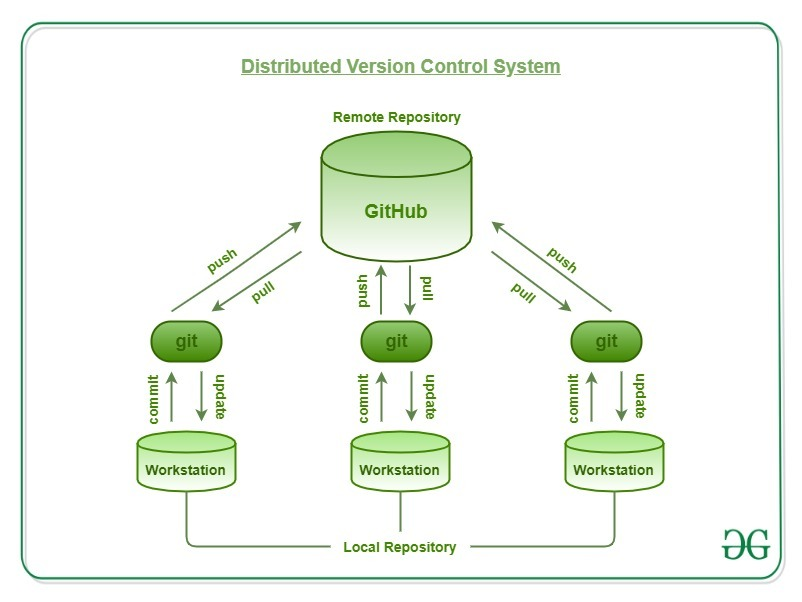

#### [🔙 Back to README](../../README.md)

# Git Basics: Core Concepts and Architecture

## 1. Types of Version Control Systems

There are three main types of version control systems (VCS):

* **Local Version Control Systems:** Manage file versions on a single local system. Example: RCS (Revision Control System).
* **Centralized Version Control Systems (CVCS):** Have a single central server that holds all versions. Developers pull and commit changes to this central server. Example: Subversion (SVN).
* **Distributed Version Control Systems (DVCS):** Every user has a full copy of the repository, including its complete history. This allows for offline work and more robust collaboration.

### What type is Git?

Git is a **Distributed Version Control System (DVCS)**.

---

## 2. Snapshots in Git

Unlike traditional systems that store differences between file versions, Git takes a **snapshot** of the entire file system each time you commit. If a file hasn’t changed, Git links to the previous identical version rather than storing it again. This model is faster and more reliable.

---

## 3. What is a Repository?

A **repository** (or "repo") is a data structure used by Git to store metadata and a complete history of changes. It can also contain the working directory (project files).

* **Local repository:** Exists on a developer’s machine and includes the working directory, staging area, and commit history.
* **Remote repository:** A version of the repo hosted on a server (e.g., GitHub, GitLab). Used to collaborate and share code.

---

## 4. What is a Commit?

A **commit** in Git is a snapshot of your project at a specific point in time. It saves all currently staged changes along with a commit message that describes what changed. Commits create a linear or branched history.

Command:

```bash
git commit -m "Describe your changes"
```

---

## 5. What is the Working Directory?

The **working directory** is the folder on your local machine where your project files live. It reflects the current checked-out version of the repository and is where you make changes before staging or committing.

---

## 6. What is the Staging Area?

Also called the **index**, the staging area is where you prepare a snapshot of your changes before committing. You explicitly add files to this area using:

```bash
git add filename
```

Only staged files are included in the next commit.

---

## 7. Git Architecture Diagram

Here’s a simplified diagram of how Git works internally:



*Source: [GeeksforGeeks - Git Features](https://www.geeksforgeeks.org/git-features/)*

---

